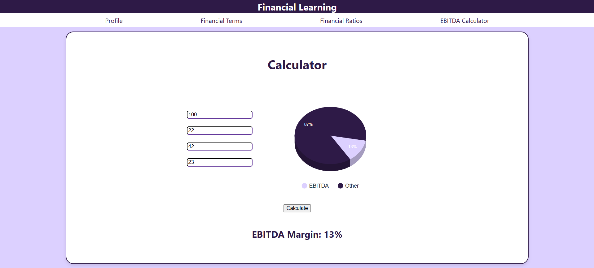
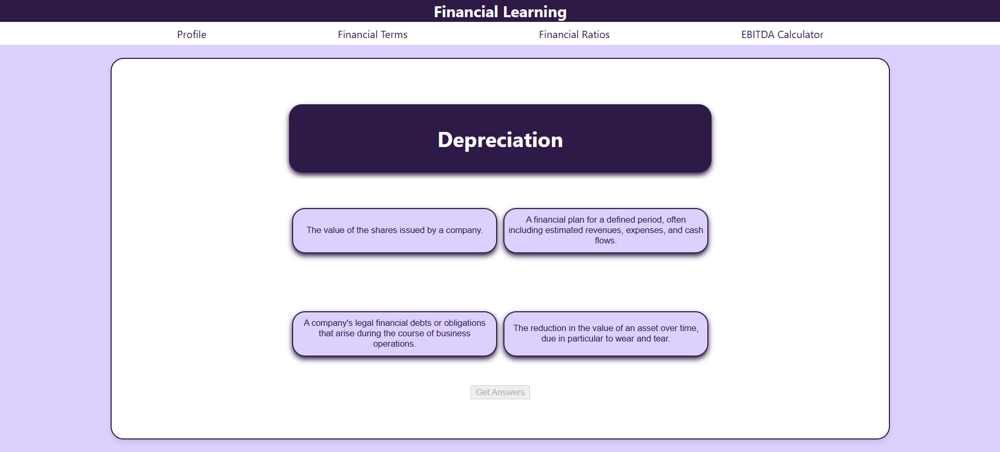
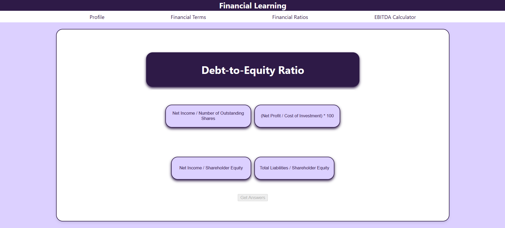
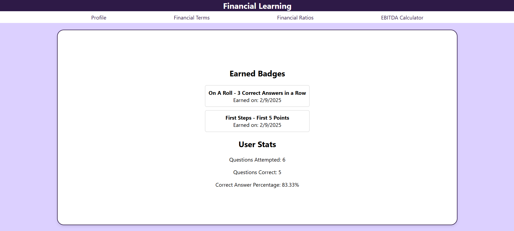

# Financial Learning - UGAHacksX

An app created during UGAHacksX 2/7-2/9/2025 meant to gamify learning about financial terms and ratios. This app also includes an EBITDA calculator and visualizer.

## Authors

- [@CC1358952](https://www.github.com/CC1358952)
- [@cullenowens](https://www.github.com/cullenowens)

## Features

- EBITDA Calculator
- Quizes on Financial Terms & Ratios
- User Statistics
- User Achievments

## Screenshots

## UGAHacksX Questions

- **Credit:** [React-Google-Charts](https://www.react-google-charts.com/) used for data visualization.
- **Purpose:** The purpose of our project was to gamify aspects of financial anaysis. We have a section that incorpoates a EBITDA calculator, with a visual effect. Then we have two seperate sections of quizzes of "Financial Ratios" and "Financial Terms" to quiz the user on financial terms. They quizzed on balance sheet definition.
- **Problems Encountered:** he biggest problem we ran into was creating seperate pages for each of the aspects of the app, then being able to use the data in one file to another, and update them at the same time, like the information in Profile, that gets updated as the user responds to questions.
